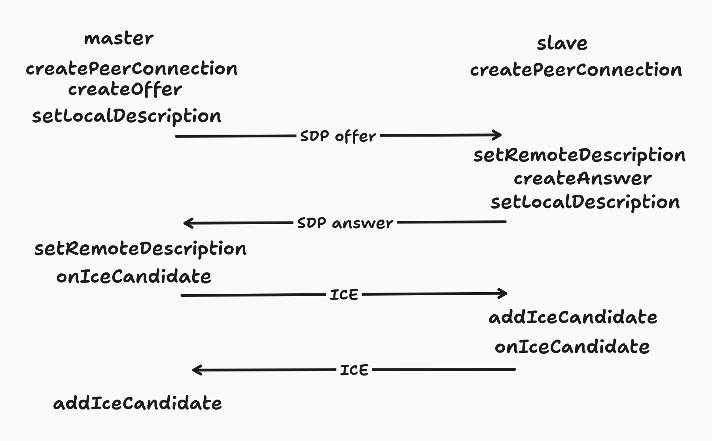

# Android 仅局域网 WebRTC 视频流与远程控制示例

本示例应用展示了如何在 Android 设备之间通过局域网使用 WebRTC 技术进行实时的视频流传输和远程控制。

## 功能

* **局域网发现:** 自动发现局域网内的其他运行本应用的设备。
* **视频流传输:** 将本设备的视频流实时传输到连接的对端设备。
* **远程控制:** 提供触摸控制功能。

## 技术栈

* **WebRTC:** 用于点对点实时音视频通信。
* **Kotlin:** 应用的主要开发语言。
* **Android SDK:** 用于 Android 应用开发。

## 快速开始

### 前提条件

* Android Studio 已安装并配置。
* 至少两台 Android 设备。
* 设备处于同一局域网。

### 运行步骤

1.  **克隆项目:**
2.  **运行 Android 应用:**
    * 在 Android Studio 中打开 `app` 模块。
    * 将应用分别运行到至少两台 Android 设备或模拟器上。
3.  **设备发现与连接:**
    * 应用会自动搜索局域网内的其他设备。
    * 在其中一台设备上点击要连接的另一台设备。
4.  **视频流与控制:**
    * 连接成功后，一台设备的摄像头视频将实时显示在另一台设备上。
    * 提供触摸控制功能。

## 详细说明

* **信令:** 使用简单的 WebSocket 实现设备之间的 SDP (Session Description Protocol) 和 ICE (Interactive Connectivity Establishment) 候选者交换，以建立 WebRTC 连接。
* **WebRTC 实现:** 基于 Android WebRTC SDK 实现音视频引擎和数据通道。
* **权限:** 应用需要录屏和网络权限。

## 注意事项

* 本应用仅为演示目的，信令服务器实现较为简单，不适用于生产环境。
* 远程控制功能仅为示例，可根据实际需求进行扩展。
* 请确保设备处于同一局域网，并且网络环境良好。

## 许可证

本项目遵循 [GPL-3.0 License](LICENSE)。